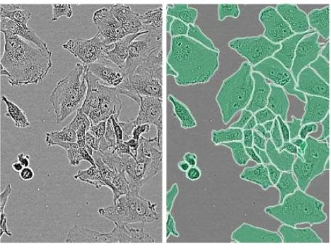

# <h1 align="center">ECE 046211 - Technion - Deep Learning - Project </h1> 
## <h2 align="center"> "Cell Counter" - A Deep Learning Analysis of cell counting in microscopic image </h2>

## Abstract
In this project, we tackle image-level cell counting on the LIVECell dataset: given a single phase-contrast image, predict one number—the total cells. We benchmark three practical routes used in microscopy: (1) instance segmentation with Mask R-CNN (count high-confidence detections; anchors retuned for tiny, crowded cells), (2) density regression with a DeepLabV3-ResNet101 (predict a non-negative density map and sum it), and (3) global regression with a ConvNeXt backbone (map the whole image directly to a non-negative count). All models share consistent preprocessing (ImageNet normalization, light flips/rotations) for a fair comparison.

We evaluate with accuracy within ±k cells (k ∈ {0,1,3,5,10,20}) and standard MAE/MSE to reflect real lab tolerance. The study highlights where each approach shines: instance segmentation is interpretable (see misses vs. false positives), density maps are robust in confluent fields with ambiguous boundaries, and global regression is fast and simple when you only need the number.

Alongside the code, we provide ready-to-run training and evaluation scripts, clear configs, and swappable heads/backbones. The goal is a practical baseline for microscopy workflows—reducing annotation burden, handling dense scenes, and delivering reliable counts that plug into growth curves, confluence monitoring, and high-throughput screening.

<div align="center">
  
</div> 

## Files in the repository

| File Name                                  | Purpose                                                                                                                                                                                    |
|--------------------------------------------|--------------------------------------------------------------------------------------------------------------------------------------------------------------------------------------------|
| `livecell_dataset_prep/extract_data.py`    | Extract LIVECell and build a cell-counting dataset (RGB PNGs per split + count metadata CSVs).                                                                                             |
| `readme_files`                             | Directory contain all readme files                                                                                                                                                         |
| `utils/constants.py`                       | Central project config—sets device/GPU, timestamp, dataset paths, model/optimizer selection, per-model training hyperparameters, and output directories.                                   |
| `utils/gpu_selector.py`                    | Pick the best GPU (lowest load, most free memory) via GPUtil and return its ID, with a safe fallback to GPU 0.                                                                             |
| `utils/logger_utils.py`                    | Initialize run-specific logging—optionally console-only, or console + per-run log file in a timestamped results subfolder—using model/train config settings.                               |
| `utils/loss.py`                            | Define loss functions for counting/segmentation (MSE/MAE, SSIM-augmented density loss, Huber/Poisson regression, Focal+Dice) and select the appropriate loss by model name.                |
| `utils/metrics.py`                         | Compute counting metrics (MSE/MAE + ±threshold accuracies), pretty-print them, plot training/validation curves, and provide helpers to count instances from predictions/masks.             |
| `benchmark_models_eval.py`                 | Evaluate off-the-shelf segmentation models (LACSS, Cellpose, CenterMask2) on LIVECell by predicting counts and computing counting metrics.                                                 |
| `environment.yaml`                         | Defines the Python environment (Python version, packages, CUDA/tooling) to recreate a consistent venv/Conda setup for the project.                                                         |
| `evaluation.py`                            | Load best saved model and config, run evaluation on val/test split to compute counting metrics and loss, and write a formatted report to the run directory.                                |
| `models.py`                                | Define and construct all model architectures (Mask R-CNN, U-Net, density regressors, direct count regressors), and provide save/load utilities for checkpoints/configs.                    |
| `optimize_flow.py`                         | Run Optuna to tune hyperparameters for the selected model on LIVECell, then save study results and plots (contours, importances, best params).                                             |
| `preprocess.py`                            | Prepare LIVECell data and PyTorch datasets (counting, Mask R-CNN, UNet), including COCO/CSV loading, centroid→density maps, and dataset transforms.                                        |
| `README.md`                                | Project overview and usage guide—explains setup, data prep, training/evaluation, and results.                                                                                              |
| `train_CellCounter.py`                     | Train the selected model on LIVECell, validate each epoch, log/plot metrics, and save the best checkpoint.                                                                                 | 


## Installation Instructions
First clone the repository
```bash
git clone https://github.com/frogman189/Cell_counter.git
cd Cell_counter
```

1. Get Anaconda with Python 3, follow the instructions according to your OS (Windows/Mac/Linux) at [link](https://www.anaconda.com/download)
2. Install the basic packages using the provided `environment.yaml` file by running: `conda env create -f environment.yaml` which will create a new conda environment named `CellCounter_venv`.
3. To activate the environment, open the terminal (or `Anaconda Prompt` in Windows) and run `conda activate CellCounter_venv`

## Dataset
We used the LIVECell data set that can be found in kaggle https://www.kaggle.com/datasets/markunys/livecell-dataset/data
1. Download the following four files:
  - LIVECell_dataset_2021.zip
  - livecell_annotations_train.json.zip
  - livecell_annotations_val.json.zip
  - livecell_annotations_test.json.zip
2. Open the script `livecell_dataset_prep/extract_data.py` and edit the dataset file paths inside the `main` function to match the directory where you placed the files.
3. Run the script.
``` bash
python livecell_dataset_prep/extract_data.py
```
This will create a new directory containing:
- All extracted images
- A CSV file with image information

## Download pretrained models for benchmark
  1. Anchor-free model
     - go to https://github.com/sartorius-research/LIVECell/tree/main/model
     - Download the anchor_free model trained on the LIVECell dataset.
     - Place the downloaded `.pth` file inside `Cell_counter/benchmark_models`, in the same folder as its corresponding configuration file.
  2. LACSS model
     - Go to https://github.com/jiyuuchc/lacss
     - Download the weights for the small-2dL model trained on the LIVECell dataset.
     - Place the weights file inside `Cell_counter/benchmark_models` as well.
  3. Clone CenterMask2
     - Clone the CenterMask2 repository into our project directory: `git clone https://github.com/youngwanLEE/centermask2.git`
    

## How to use

After installing the environment (see **Installation Instructions**) and preparing LIVECell (see **Dataset**), you can:

---

### 1) Use our pretrained checkpoints (recommended to start)
- Download checkpoints from **Google Drive** (link TBD).
- Unzip and place them under ./results/
- in `utils/constants.py`, set the model you want to evaluate::
```python
MODEL_NAME = '<one of: Mask_R_CNN_ResNet50, Unet, UNetDensity, DeepLabDensity, MicroCellUNet, ViT_Count, ConvNeXt_Count, CNNTransformerCounter>'
```
- Point to the checkpoint directory (per model) so `evaluation.py` can find it. For example:
```python
# Map model name -> absolute path of the run directory containing the best checkpoint
model_pathes = {
    'UNetDensity': '/home/meidanzehavi/Cell_counter/results/UNetDensity/UNetDensity_20250811-121939'
}
```
- Run evaluation (choose split inside the script: val or test):
```bash
python evaluation.py
```

### 2) Train a model from scratch
- In `utils/constants.py`, configure:
  - `MODEL_NAME` (architecture)
  - Optimizer (`OPTIMIZER_NAME`)
  - Any hyperparameters in `train_cfg` dictionary

- Start training:
```bash
python train_CellCounter.py
```

- Best checkpoint, logs, and curves are saved under a timestamped results directory.

### 3) Hyperparameter tuning with Optuna

- (Optional) Adjust search space/trials in `train_CellCounter.py`
- Run:
```bash
python optimize_flow.py
```

- Inspect saved study artifacts (best params, importance/contour plots) in the results directory.

### 4) Evaluate benchmark models

- In `benchmark_models_eval.py` define the `EVAL_MODEL` and run:
```bash
python benchmark_models_eval.py
```
- The script computes counts from predictions and reports the same counting metrics.


## Hyperparameter Tuning

We tuned training hyperparameters with **Optuna** to maximize the validation score returned by our training loop (`train()`), using a **TPESampler** over **100 trials** (`NTRAILS = 100`). The study name is timestamped (`optimize_hyperparameters_<TIME>`), and all artifacts (CSV of trials, contour plots, parameter importance, and `best_params.txt`) are saved under `OUTPUT_OPTUNA_DIR/optimization_run_<TIME>/`.

The search covers general knobs (learning rate, batch size) and model-specific ones:
- **DeepLabDensity**: density vs. SSIM loss weights.
- **ConvNeXt_Count**: Huber loss delta.
We also compared optimizers (**SGD**, **Adam**, **RAdam**) and briefly tried a **cosine LR schedule with warmup**; empirically, **Adam** without the cosine schedule performed best for our final runs.

The objective was **maximized** and pruning/visualization utilities were enabled:
- Contour plots for selected parameter pairs (e.g., `lr`×`batch_size`, and model-specific pairs).
- Parameter importance plots.
- A CSV export of all trials for offline analysis.

> After running `python optimize_flow.py`, the **final (best) values** below can be read from  
> `OUTPUT_OPTUNA_DIR/optimization_run_<TIME>/best_params.txt`.

### Tuned Hyperparameters

| Hyperparameter name | Range of search | Final value (best trial) |
|---|---|---|
| `optimizer`  | `{SGD, Adam, RAdam}` | `Adam` |
| `scheduler` *(tried & rejected)* | `{cosine_warmup, none}` | `none` |


**Instance segmantaion:**

| Hyperparameter name | Range of search | Final value (best trial) |
|---|---|---|
| `model` | `{Mask-R-CNN ResNet50, Unet}` | *Mask-R-CNN ResNet50* |
| `lr` | `[1e-5, 1e-3]` (log-uniform) | *`4.82e-4`* |
| `batch_size` | `{4, 8}` | *`4`* |


**Density regression:**

| Hyperparameter name | Range of search | Final value (best trial) |
|---|---|---|
| `model` | `{UNetDensity - FCN-ResNet50, DeepLabDensity - DeepLabv3-ResNet101 with ASPP, MicroCellUNet - SMP ResNet50 encoder + lightweight high-res branch with micro-attention}` | *DeepLabDensity* |
| `lr` | `[1e-5, 1e-3]` (log-uniform) | *`2.33e-5`* |
| `batch_size` | `{4, 8, 16, 32}` | *`16`* |
| `weight_density` | `[0.0, 2.0]` step `0.1` | *`1.6`* |
| `weight_ssim` | `[0.0, 2.0]` step `0.1` | *`0.7`* |

**Global regression → count directly:**

| Hyperparameter name | Range of search | Final value (best trial) |
|---|---|---|
| `model` | `{ViT - ViT-B/16, ConvNeXt - ConvNeXt-Small, CNNTransformerCounter - ResNet50 (C5) → 1×1 conv (to 768) → 14×14 tokens + CLS → ViT encoder → mean pool → MLP → ReLU}` | *ConvNeXt* |
| `lr` | `[1e-5, 1e-3]` (log-uniform) | *`2.38e-5`* |
| `batch_size` | `{4, 8, 16, 32}` | *`16`* |
| `huber_delta` | `[0.0, 10.0]` step `0.5` | *`3.0`* |


## Training Results


## Results

**Threshold accuracy \(\mathrm{Acc}_{\pm t}\) on LIVECell test set**

| Model | ±0 | ±1 | ±3 | ±5 | ±10 | ±20 |
|---|---:|---:|---:|---:|---:|---:|
| Mask R-CNN (ours)          | 1.1 | 5.0 | 11.2 | 15.0 | 21.9 | 28.2 |
| DeepLabDensity (ours)      | 1.3 | 4.6 | 10.9 | 16.3 | 30.3 | 51.5 |
| ConvNeXt regression (ours) | 1.7 | 6.0 | 12.7 | 17.7 | 31.9 | 55.6 |
| Cellpose (LIVECell-tuned)  | 0.26 | 0.46 | 1.12 | 2.84 | 7.94 | 21.56 |
| LACSS (LIVECell)           | 0.00 | 0.00 | 0.13 | 0.13 | 0.13 | 0.13 |
| CenterMask2 (LIVECell)     | 0.60 | 1.06 | 2.12 | 3.44 | 6.02 | 12.04 |

**LIVECell test-set error metrics**

| Model | MSE | RMSE | MAE | Mean count (Pred / GT) |
|---|---:|---:|---:|---|
| Mask R-CNN (ours)          | 135575.47 | 368.21 | 210.37 | 90.78 / 300.02 |
| DeepLabDensity (ours)      | 14038.72  | 118.49 | 54.74  | 269.55 / 300.02 |
| ConvNeXt regression (ours) | 10133.08  | 100.66 | 47.09  | 280.40 / 300.02 |
| Cellpose (LIVECell-tuned)  | 121477.39 | 348.54 | 188.92 | 111.56 / 300.02 |
| LACSS (LIVECell)           | 180647.02 | 425.03 | 292.11 | 7.91 / 300.02 |
| CenterMask2 (LIVECell)     | 119104.81 | 345.12 | 198.34 | 147.86 / 300.02 |


## Conclusion
Our purpose-built counting models consistently beat the baselines on LIVECell. Unlike general-purpose segmentation systems, they’re optimized for count regression, which avoids mask/detection aggregation errors and handles LIVECell’s tiny, crowded, low-contrast cells better. Targeted choices (anchor tuning, consistent preprocessing, density/SSIM or Huber losses) further tighten MAE/MSE and ±k accuracy.


---

## 📜 Project Documentation
The full project report, including the methodology, results, and conclusion, is available in the `report/` directory.
